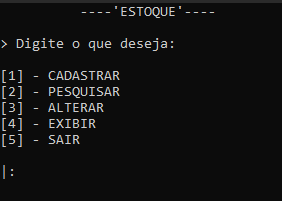

# 📦 Projeto de Controle de Estoque em C

Este projeto é um sistema simples de controle de estoque feito em `linguagem C`, utilizando leitura e gravação em `arquivos binários` para armazenar os dados dos produtos. Foi meu primeiro "projeto" quando iniciei meus estudos em programação. 

---

## 🚀 Funcionalidades

O programa simula um gestor de estoque, com funções de cadatro, exibição de produtos, pesquisa por codigo, alteração de preço e quantidade. Em suma são:

- Cadastro de produtos com nome, código, quantidade e preço.
- Consulta ao estoque atual.
- Entrada e saída de itens.
- Atualização de dados.
- Salvamento em arquivos `.bin`.

# 🖥 Exemplo gráfico

Uma imagem de como é o menu principal das operações do sistema.



É um sistema simples, mas que serviu de bastante aprendizado.

---

## 🧱 Tecnologias utilizadas

- Linguagem C.
- Manipulação e criação de arquivos binários (`fwrite`, `fread`, `fseek`).
- Compilador `GCC` (ou `MinGW` no Windows).

## 📋 O que melhorar

- [ ] Adicionar a função de remoção de produtos em estoque.

---

## ⚙️ Como compilar e executar

O sistema não possui interface gráfica própria, portanto sua execução é via terminal. Portanto, o sistema deve ser executado em ambiente Windows, pois utiliza funções específicas deste sistema operacional.

### Compilar:

É necessário ter o compilador da linguagem C ([MinGW](https://sourceforge.net/projects/mingw/)) instalado e operando nas variáveis de ambiente do sistema operacional.

```bash
gcc nome_do_arquivo.c -o programa.exe

